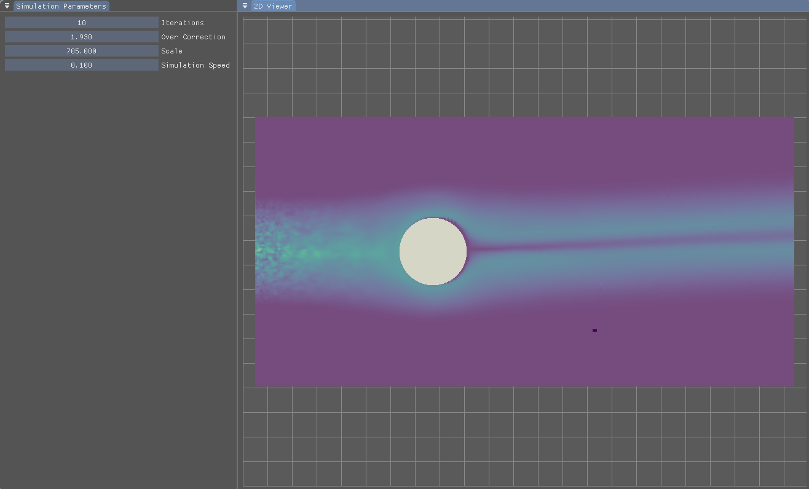

# SirSim
A lightweight engine for fluid simulations



## Install and Build
### Linux 
The only dependencies that this system should have is *X11*.

__To Install__
```bash
git clone https://github.com/EnriqueM12/SirSim
cd SirSim
git submodule update --recursive --init
```

__To Build__
```bash
cmake -B build
cd build
make
```

Make sure that when you are running, that you are cd'ed to the build
directory.

__To Run__
```bash
cd build
./SirSim
```

